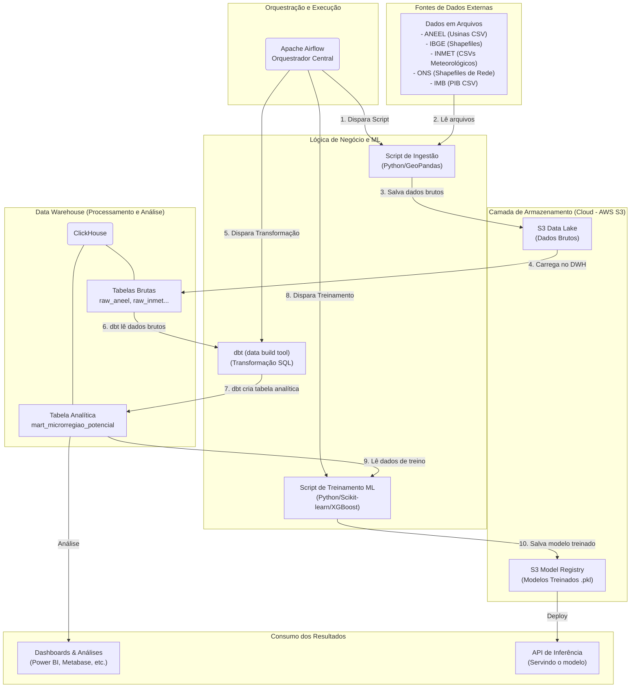

# Projeto Goiás Renovável - ml-politicas-energeticas-ifg-2025
PROJETO — MÓDULO 2: Machine Learning para Políticas Públicas Energéticas - POS IA IFG 2025/1

## Arquitetura do Pipeline de Dados e MLOps

Aqui está o fluxo de trabalho automatizado para o projeto de potencial energético, desde a extração de dados até o treinamento do modelo.




# Activate DBT env


```bash
 conda activate ml-dbt
```

conda deactivate